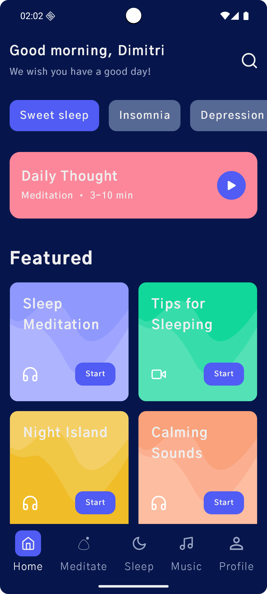
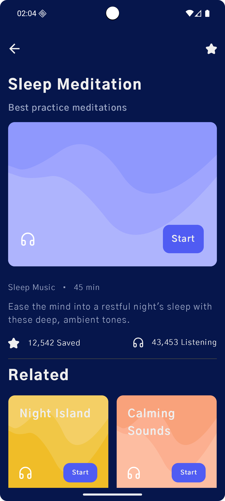

# Meditation Mobile App UI

Android UI built in Jetpack Compose based on the "Meditation Mobile App" design.

## Screenshots

  
  

## Design Attribution
The original UI design was created by [*Misha Dupliakin for Elixirator*](https://dribbble.com/shots/15822493-Meditation-Mobile-App)
and published on Dribbble.

This repository contains only the Android implementation.  
All design credits belong to the original creator.
